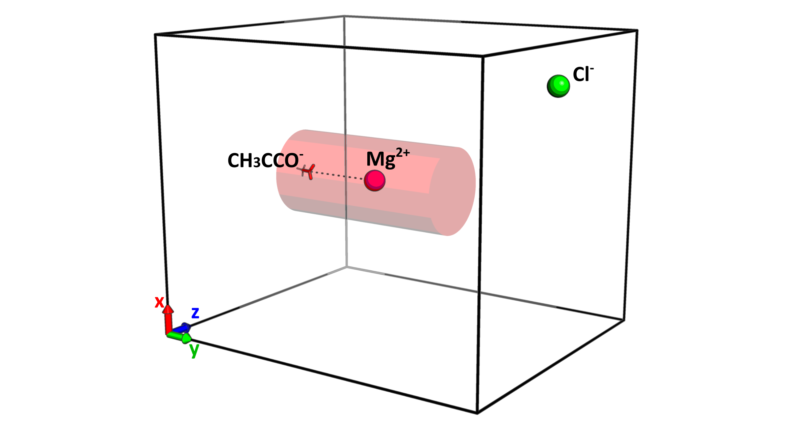
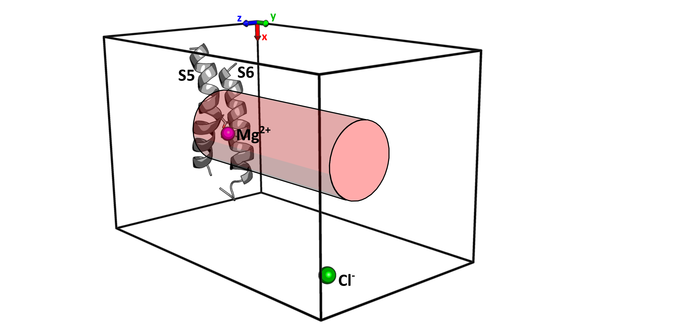

# The locking ****mechanism**** of human TRPV6 ****inhibition by intracellular magnesium**

This repository contains the code used in the article "**The locking mechanism of human TRPV6 inhibition by intracellular magnesium**" by Arthur Neuberger, Alexey Shalygin, Irina I. Veretenenko, Yury A. Trofimov, Thomas Gudermann, Vladimir Chubanov, Roman G. Efremov, Alexander I. Sobolevsky.

# Model systems

In the article, two model system were taken under consideration:

* Acetate system (AS)

  
* Protein system (PS)

  

# WTMD simulations protocol

Well-tempered metadynamics

# WTMD postprocessing
